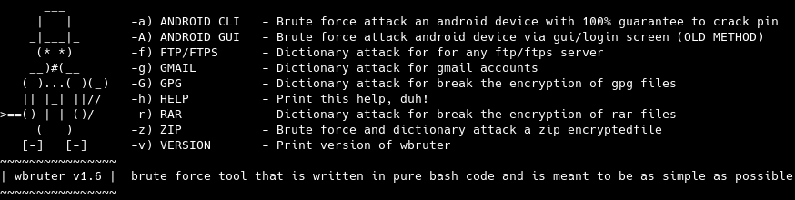

# WBRUTER

#### README

wbruter is a a brute force tool for attack android devices with **100%** guarantee to crack the pin code aslong as usb debugging has been enable. wbruter also includes some other brute methods like dictionary attacks for gmail, ftp, rar, zip and some other file extensions. I wont add brute methods for facebook, instagram, snap or other sites like these because there is already tons of these tools on github.

_Many times it's the easiest methods that are the most powerful methods, it's just a matter of using your imagination ;-)_

#### News: 2019-01-14

I decided to release my private tool for brute forcing for android devices wich is supported on all android devices from android 5.0(that's last version i have been able to try) since I have seen so many wikis/tutorials online that wont work for  non-rooted devices, they are all kinda useless since you wont be able to remove the locksettings.db file wich is the where the pin code is stored because android devices is mounted as ro(read only) and this can't be bypassed unless the android device has been rooted so we can remount it as rw(read-write) instead. How many % of all devices has been rooted if we count * devices out there, we can agree that it's pretty few compared to non-rooted devices, see my example here below how it goes if the phone is non-rooted: 

**But hey**, from now you don't need to bother about all these lame tutorials around the net wich wont work for majority of all that owns an android device. My android device in the preview video is an Huawei P8 Lite and it's a 
slow CPU in this phone and it's only 3GB amount of ram in this device wich is pretty low comparing to the new phones on the market so it might be much faster on your android device.

My earlier version in this repo is nowadays pretty useless since it's almost impossible to brute force the pin lock via login screen(GUI) since after 4 wrong pin code attempts we will be blocked for X seconds, and after 5 
attempts we getting blocked for even more seconds etc etc so it will take until forever kinda to succeed with this method and almost all android devices has a protection that will wipe or factory reset the device to default settings after ~4-10 wrong pin attempts and that will result in data loss wich  is _almost_ impossible to recover _unless you really know what you are doing. In my videos below i proove that my device is non-rooted and this method actually gonna work to crack the pin no matter how many pin attempts you will need until the pin has been cracked. I decided to use +20 attempts since that's enough for proove that it actually working. wbruter is the first tool online that has been released to public with this uniqe method. There is no reason for search on google anymore for tips and tricks for 'how-to break android's pinlock' cause as you probably already has figured out 90-95% of all sites (even some devs on xda-developers forum) claims that you can remove locksettings.db from data/system dir wich you have seen is impossible 

You don't have to be fooled anymore, enjoy a tool that actually works.

## Enable USB-Debugging via the methods below:

#### Via GUI: 
Go to settings -> about > press on build number 7 times and the developer settings will be enable, go back to settings and press on developer mode and then enable USB DEBUGGING. If you found an android deviceon the street or something and want to break the pin this wont be possible unless you already know the pin so the device must have usb debugging enable for this to work. You wanna try this for fun then you can just enable usb debugging after you unlocked phone)

#### Via cli/adb: 

     settings put global development_settings_enabled 1
     setprop persist.service.adb.enable 1

#### Preiew 1 - ANDROID CLI
##### use ./wbruter -a 4 for this method

#### Preiew 2 - ANDROID CLI - PARALLEL

#### Preiew 3 - GMAIL

#### Preiew 4 - FTP/GLFTPD

#### Preiew 5 - GPG

#### HOW TO

    git clone https://github.com/wuseman/WBRUTER
    cd wbruter; ./wbruter [-X]

    Thats it, easier than this it can't be for attack various stuff, execute wbruter with the method you wanna use and then fill in the options and it's done.
    
    wbruter has been developed for give all users the opportunity to restore the PIN-Code/Password if the user has managed to forget the pin code or password so they will be able to save the data on their device/account. 

    Try to not break any law with this tool if there is a law against to recover a pin code in your country unless you own the device, or is it illegal data infringement? I have no idea and tbh i really do not care, have fun with wbruter!

#### REQUIREMENTS

A linux setup would be good ;)

#### CONTACT 

If you have problems, questions, ideas or suggestions please contact me by posting to wuseman@nr1.nu

#### WEB SITE

Visit my websites and profiles for the latest info and updated tools

https://github.com/wuseman/ && https://nr1.nu && https://stackoverflow.com/users/9887151/wuseman

#### END!
